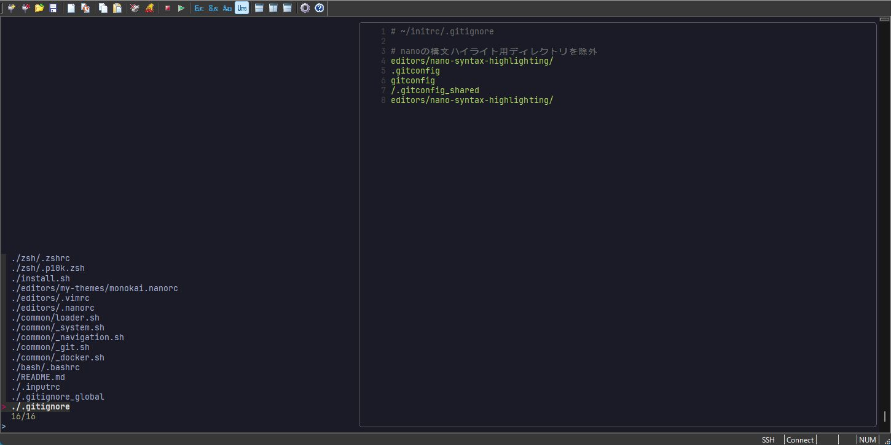
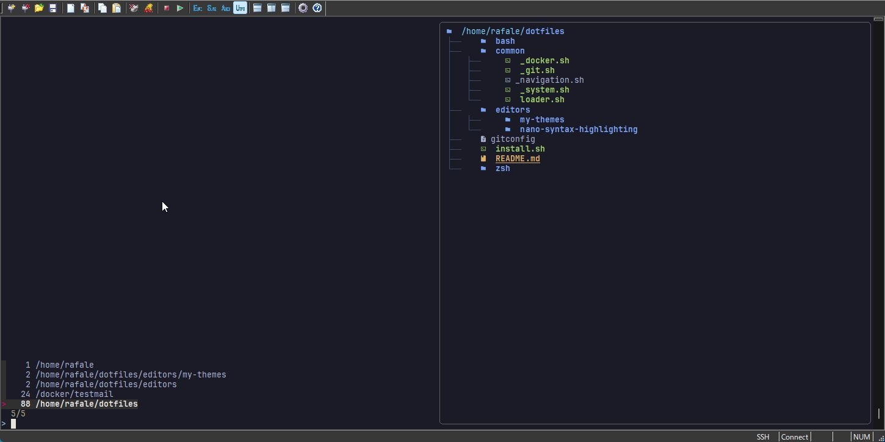
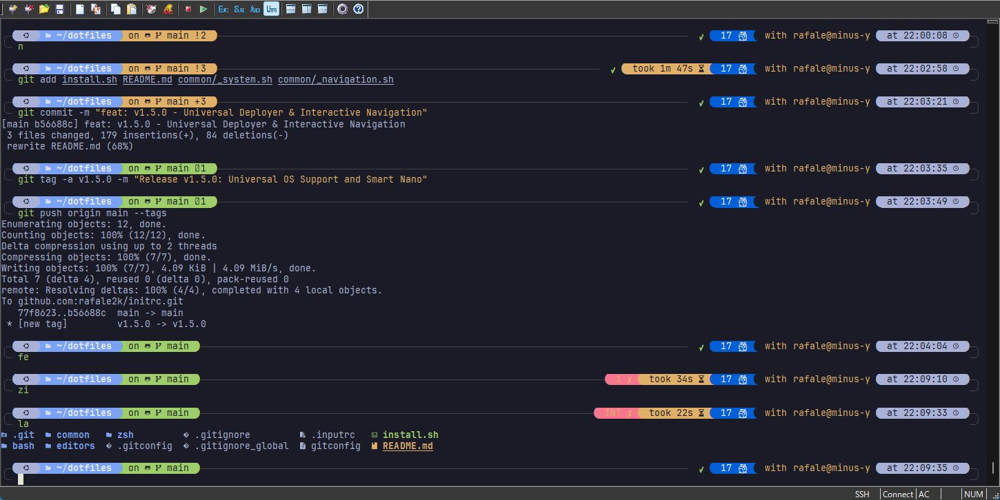

# 🚀 initrc: The RC Files Recreator


> **"Environment construction in 0 seconds."**
> `initrc` は、単なる設定のコピーではありません。実行環境に合わせてツールを自動調達し、設定ファイルを動的に **"Recreate（再生成）"** する、エンジニアのための最強スターターキットです。

---

## 🖼️ Showcase

### 🔍 1. Interactive File Search (n / fe)
`fzf` + `bat` による高速プレビュー検索。エディタを開く前に中身を瞬時に確認できます。


### 🌳 2. Smart Navigation (zi)
`zoxide` と `eza` が連携。ディレクトリ構造をツリー表示でプレビューしながら、爆速で移動します。


### 🎨 3. Terminal UI & Color Context
**Tokyo Night** の洗練された配色。Nano 編集時には自動で **Monokai 背景** へ切り替わり、作業への没入感を高めます。


---

## 🛠️ "Recreator" としての核心機能

### 📦 Universal Deployer (Multi-OS Support)
`install.sh` が OS を自動判別し、適切なパッケージマネージャー (`apt`, `dnf`, `brew`) を選択。モダンツールのリポジトリ登録からインストールまでを全自動化します。

### 🎨 Smart Terminal Context
通常時は **Tokyo Night**、Nano 編集時のみ **Monokai グレー** 背景へ。視覚的に「編集モード」を認識させる独自のカラー制御を搭載。

### ⚡ Zero-Conflict Shell Integration
- **Cross-Shell Support**: Bash/Zsh 両対応。
- **Auto-Unalias**: 既存の競合エイリアスを自動回避し、常に `initrc` 独自のツールセットを展開。

---

## 🏎️ Power Features

| Command | Feature | Description |
| :--- | :--- | :--- |
| `n` | **Smart Nano** | **(New)** 引数なしで起動。プレビュー検索から即座に編集開始。 |
| `fe` | **File Explorer** | `fd` + `bat` による高速プレビュー検索。エディタで開く。 |
| `zi` | **Smart Jump** | `zoxide` 連携。`eza` によるツリープレビュー付きワープ。 |
| `la` | **List All** | `eza` によるアイコン付き隠しファイル一覧表示。 |

---

## 📂 リポジトリ構造

- **`install.sh`**: OS自動判別・依存ツール一括セットアップ
- **`common/`**: 機能別に分割された設定群
    - `_system.sh`: 配色・基本コマンド・モダンツール置換
    - `_navigation.sh`: `n`, `fe`, `zi` 等の対話型ナビゲーション
    - `_docker.sh` / `_git.sh`: 各ツール専用設定
    - `loader.sh`: コア・ローダー

## 🚀 クイックスタート

```bash
git clone [https://github.com/rafale2k/initrc.git](https://github.com/rafale2k/initrc.git) ~/dotfiles
cd ~/dotfiles && ./install.sh
source ~/.zshrc
```

---
© 2026 Rafale / initrc Project.
---
