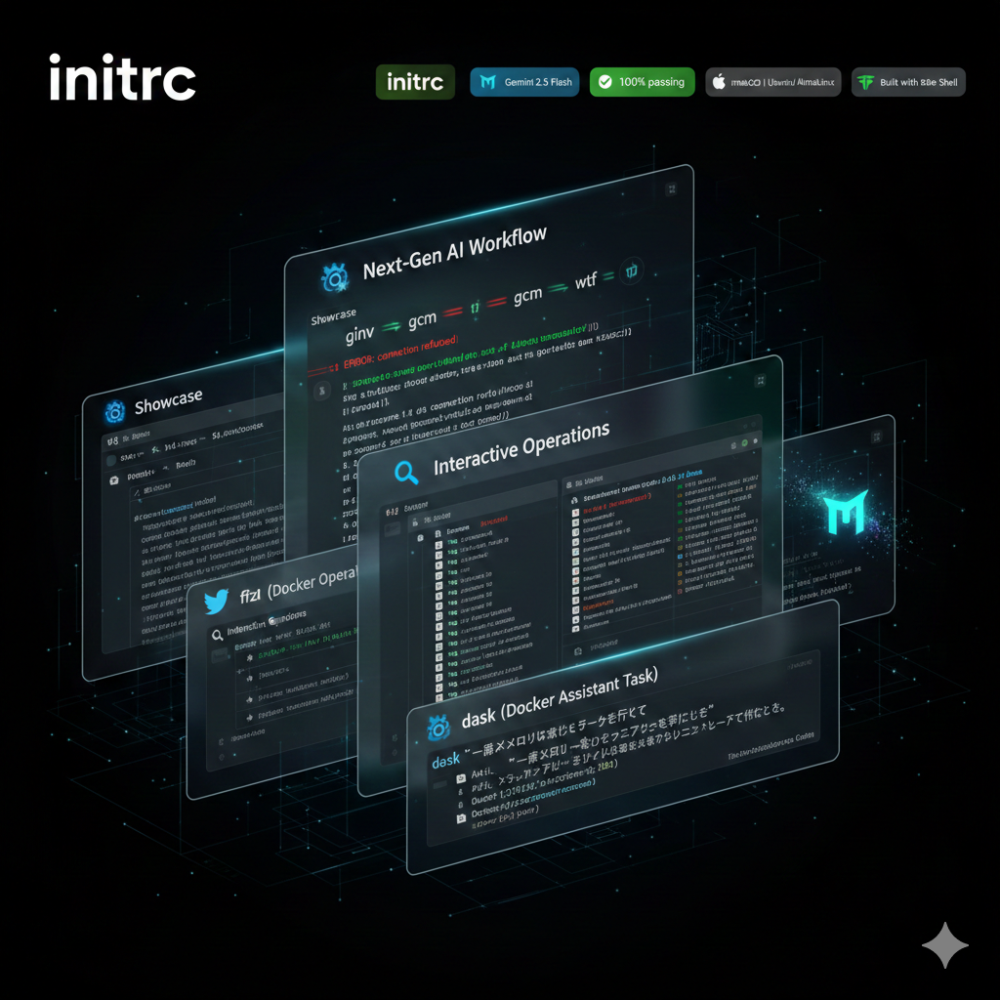

# 🚀 v1.25.0 - The AI-Enhanced SRE Framework


### 🌍 Supported Distributions


---


[](https://x.com/rafale)

> SRE（Site Reliability Engineering）としての「堅牢性」と「知能」を追求したターミナル環境。
> すべてのスクリプトは **Shellcheck** をパス。AI 連携による次世代のオペレーション体験を提供します。

---

## 🖼️ Showcase



---

---

## 🏗️ v1.25.0 - What's New
- **Automated SRE Release**: `bin/release` による自動 Lint、CHANGELOG 生成、GitHub Release 連携を完全自動化。
- **Tagging Standard**: バージョニングに `v` プレフィックスを導入。セマンティックバージョニングを厳守。
- **AI-Native Workflow**: `llm` と `Gemini` を統合。シェルから直接インフラ診断が可能。
- **Modular Architecture**: `common/`, `zsh/`, `bash/` への責務分離により、保守性を極限まで向上。

## 🚀 Concept
- **Reliability First**: `if-else` とエラーハンドリングを徹底。破壊的コマンドの誤実行を AI が検知。
- **Context Awareness**: 一般ユーザーは **Monokai Dark**、rootユーザーは **Tokyo Night**。視覚的安全装置を完備。
- **Zero Friction**: ツール間の競合（Zoxide vs Frameworks）を完全に排除。

---

## 🤖 AI Assistant (SRE Copilot)
自然言語でシェルを操作する、SRE 専用の AI 関数群です。

### 1. `ask` (General Assistant)
自然言語からシェルコマンドを生成し、実行の可否を問います。
- `ask 'find large files and sort by size'`

### 2. `dask` (Docker Assistant)
Docker のコンテキスト（Status, Logs, Compose）を自動解析し、トラブルシューティングを提案。
- `dask 'why is the web container restarting?'`

### 3. `kask` (Kubernetes Assistant)
K8s クラスターの状態、Namespace の異常、Events を解析。
- `kask 'check failed pods in production'`

### 4. `wtf` (Contextual Debugger)
直前のエラーメッセージやクリップボードの内容を解析し、原因と対策を提示。

---

## 🛠️ The SRE Toolkit (Custom Functions)

### 1. `h` (Smart History)
履歴を `fzf` で曖昧検索。Monokai カラーでハイライトし、プロンプトに復元。

### 2. `l` (Advanced Monitor)
`l` でログ監視、`l [Port]` でポート調査、`l [Keyword]` でプロセス検索。

### 3. `up` (Directory Jumper)
`up 3` で 3 階層上へ、`up src` で親ディレクトリの `src` へワープ。

### 4. `lt` (Enhanced Tree)
`eza` を使用。Git ステータスとアイコン付きのディレクトリ構造表示。

---

## 🎨 Terminal Colors

| User | Theme | Background | Highlights |
| :--- | :--- | :--- | :--- |
| **General** | Monokai Dark | `#272822` | Pink / Green / Cyan |
| **Root** | Tokyo Night | `#1a1b26` | Blue / Red / Purple |

---

## 📦 Requirements
- `fzf`, `eza`, `bat`, `zoxide`, `ccze`, `shellcheck`
- `python3` & `llm` (AI 機能用)

---

## 🏎️ アップデート・インストール手順

**新規インストール:**
```bash
git clone [https://github.com/rafale2k/initrc.git](https://github.com/rafale2k/initrc.git) ~/dotfiles
cd ~/dotfiles
./install.sh
```

**既存環境の更新:**
```bash
git pull origin main
reload
```

**環境の削除 (Uninstaller):**
```bash
./uninstall.sh  
```

 **開発者用リリース (SRE workflow):**
```bash
bin/release 1.25.0  # 自動的に v1.25.0 としてタグ打ち・リリース
```

---

## 🔑 API Key Setup
- ~/.dotfiles_env に export GEMINI_API_KEY="your_key" を追記。

- エンジンにキーを登録: llm keys set gemini # プロンプトに従い API Key を入力

---

**"Automate like an SRE, look like a Pro."**
© 2026 Rafale / initrc Project.
