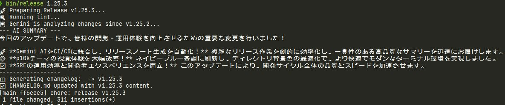
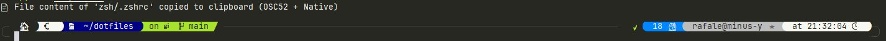
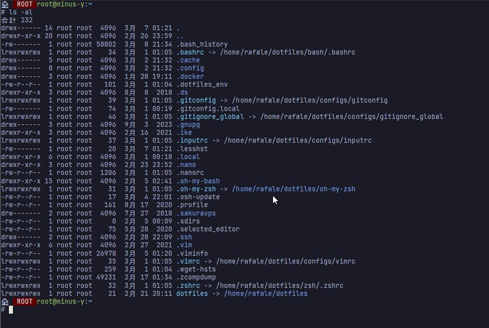

# 🚀 initrc - The Autonomous SRE Framework


### 🌍 Supported Distributions


---


[](https://x.com/rafale)

> **"Hope is not a strategy."（希望は戦略やない）**
> SREとしての「堅牢性」と「自己修復」を追求した、AI駆動型の開発・運用環境。
> v1.31.0 より、Docker Hub を通じた **「ポータブルな城」** としての配布を開始しました。

---

## 🖼️ Showcase


---

## 📸 Visual Gallery & Demos

`initrc` の主要な機能と、洗練された開発環境のインターフェースを紹介します。

### 🤖 AI-Driven Release Workflow
`bin/release` コマンドを実行すると、Gemini AI が前回のタグからの差分を自動解析。情熱的なリリースノートを生成し、GitHub と CHANGELOG を一瞬で同期します。



### 📋 Universal Clipboard (OSC52 + Native)
SSH 越しでも、ローカル環境でも。`copyfile` や `osc_copy` を使えば、常に「手元のクリップボード」にデータが届きます。OSC52 エスケープシーケンスと OS 標準ツール（pbcopy/clip.exe/xclip）のハイブリッド仕様です。



### 🎨 Deep Blue "Professional" Prompt
Powerlevel10k をカスタマイズし、カレントディレクトリの背景を視認性の高い **Deep Navy (Color 18)** に刷新。ノイズを削ぎ落とし、長時間のコーディングでも集中力を切らさない配色を実現しました。root時には背景色をTokyoNightに、プロンプトに赤背景にROOTと明記しました。


---

## 🛠️ Key Features

### 1. Autonomous Maintenance
- **dcheck**: 1時間おきに裏で環境の整合性をチェック。作業の手を止めずに環境の「腐敗」を防ぎます。
- **Idempotent Installer**: どの環境で何度実行しても、常に最適な状態に収束。

### 2. SRE & Productivity Tools
- **zoxide (j/zi)**: 過去の履歴からディレクトリをインタラクティブに瞬間移動。
- **eza/bat/fd**: 次世代の標準ツールを統合し、視認性と検索速度を極限まで向上。
- **Git Aliases**: `gquick` (一括Push)、`gs` (Status) など、手数を減らすエイリアス群。

### 3. Safety Net
- **bu [file]**: ファイルをいじる前に実行。`~/.dotfiles_backup/manual` にタイムスタンプ付きで保存。
- **bulist**: バックアップ履歴を古い順に一覧表示（eza ソート最適化済み）。

---

## 🤖 AI Assistant (SRE Copilot)
自然言語でシェルを操作する、SRE 専用の AI 関数群。

- **`ask`**: シェルコマンドの生成・実行支援。
- **`dask`**: Docker コンテナのログ解析・トラブルシューティング。
- **`wtf`**: 直前のエラーメッセージの原因と対策を提示。

---

## 📦 Requirements
- `zsh` / `bash`
- `fzf`, `eza`, `bat`, `zoxide`, `fd`, `shellcheck`
- `python3` & `llm` (AI 機能用)

---

## 🎨 Terminal Colors

| User | Theme | Background | Highlights |
| :--- | :--- | :--- | :--- |
| **General** | Monokai Dark | `#272822` | Pink / Green / Cyan |
| **Root** | Tokyo Night | `#1a1b26` | Blue / Red / Purple |

---
## 🚀 Latest Updates
<!-- RELEASE_NOTES_START -->

## [v1.35.2] - 2026-03-17
- chore(docker): Include Git and recursive directories (bd67542)
- chore: release v1.35.1 (d6111f2)
- chore: release v1.35.1 (9828302)
- chore: major fix for container environment and unify contributors in v1.35.0 (01dc0bc)
- chore: release v1.35.1 (348270f)

<!-- RELEASE_NOTES_END -->

---
## 🛠️ Usage

## 🐳 Quick Start with Docker (Recommended)

インストール不要。Docker さえあれば、一瞬で君の「城」を召喚できます。

```bash
docker run -it --rm \
  --group-add $(stat -c '%g' /var/run/docker.sock 2>/dev/null || echo 0) \
  -v /var/run/docker.sock:/var/run/docker.sock \
  -e LLM_GEMINI_KEY="あなたのGEMINI_API_KEY" \
  rafale2k/initrc:latest
```
💡 Tips for Docker Users
ホスト側の .zshrc にエイリアスを貼っておくと、次から一瞬で起動できます。

```bash
alias rfi='docker run -it --rm --group-add $(stat -c "%g" /var/run/docker.sock 2>/dev/null || echo 0) -v /var/run/docker.sock:/var/run/docker.sock -e LLM_GEMINI_KEY="YOUR_KEY" rafale2k/initrc:latest'
```

---

## 🏎️ Traditional Installation

**新規インストール:**
```bash
git clone [https://github.com/rafale2k/initrc.git](https://github.com/rafale2k/initrc.git) ~/dotfiles
cd ~/dotfiles
./install.sh
```

**既存環境の更新:**
```bash
git pull origin main
reload
```

**環境の削除 (Uninstaller):**
```bash
./uninstall.sh  
```

---

## 🔑 API Key Setup
- ~/.dotfiles_env に export GEMINI_API_KEY="your_key" を追記。

- エンジンにキーを登録: llm keys set gemini # プロンプトに従い API Key を入力

---

**"Automate like an SRE, look like a Pro."**
© 2026 Rafale / initrc Project.
