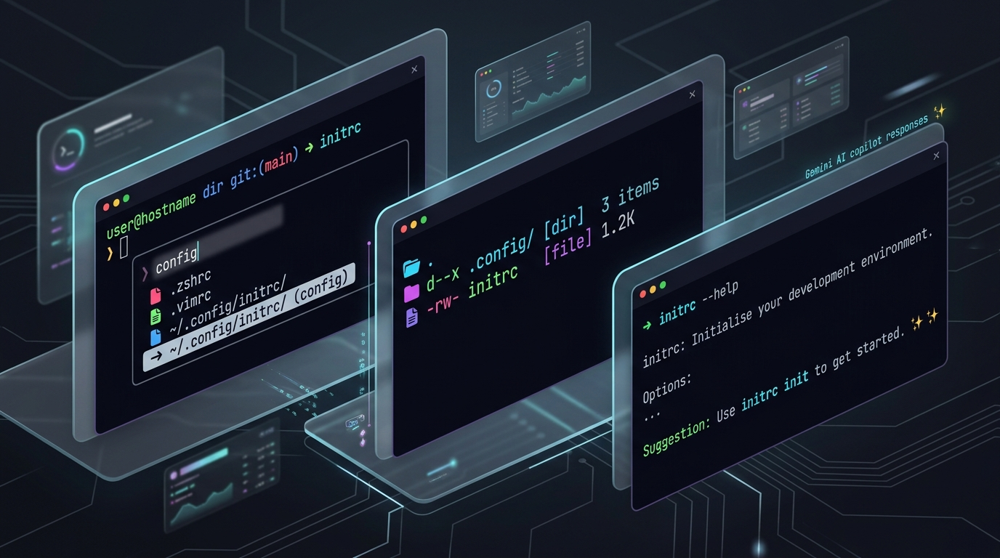
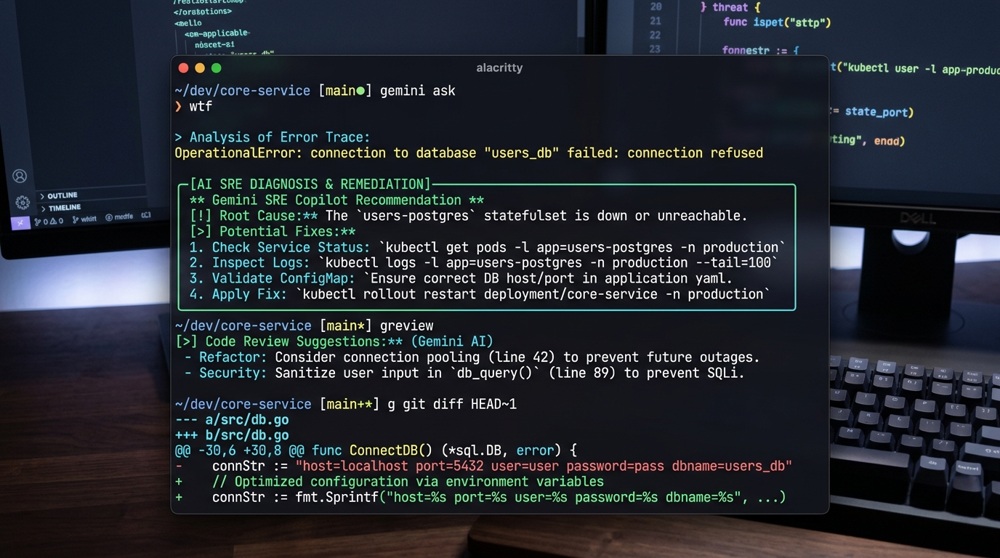
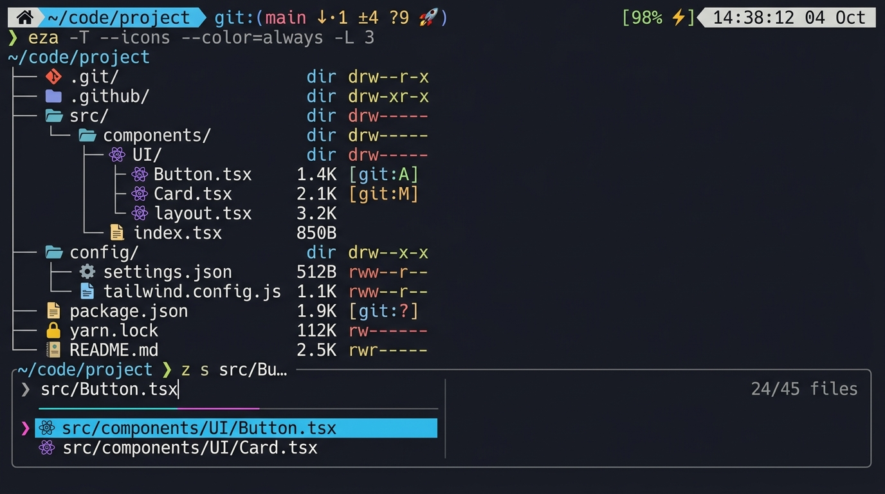
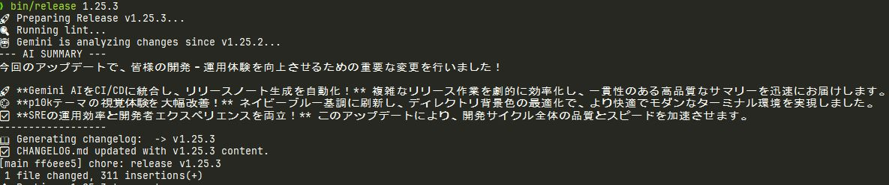
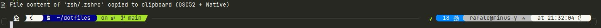

# 🚀 initrc - The Autonomous SRE Framework


### 🌍 Supported Distributions


---


[](https://x.com/rafale)

<p align="center">
  
</p>

<div align="center">

> **"Hope is not a strategy."（希望は戦略やない）**  
> SREとしての「堅牢性」「自律回復」「爆速の操作性」を極限まで追求した、AI駆動型の次世代シェル＆コンテナ環境。  
> どこでも一瞬で呼び出せる **「ポータブルな城」**。

[🚀 クイックスタート](#-クイックスタート--quick-start) • [✨ コア機能](#-コア機能--core-features) • [📋 コマンドリファレンス](#-コマンドリファレンス--command-reference) • [🗂️ アーキテクチャ](#️-アーキテクチャ--architecture) • [🚀 リリースノート](#-latest-updates)

</div>

---

## 🖼️ ビジュアルギャラリー & デモ

<table align="center" width="100%">
  <tr>
    <td width="50%" align="center">
      <b>🤖 AI SRE Copilot & Diagnosis</b><br/>
      <br/>
      <sub><code>ask</code> / <code>wtf</code> / <code>greview</code> で Gemini 3 Flash がエラー原因・K8s/Docker状態・差分を即時診断</sub>
    </td>
    <td width="50%" align="center">
      <b>🧭 Smart Interactive Navigation</b><br/>
      <br/>
      <sub><code>zoxide</code> + <code>fzf</code> + <code>eza</code> + <code>bat</code> による快適なファジー検索＆リッチプレビュー</sub>
    </td>
  </tr>
  <tr>
    <td width="50%" align="center">
      <b>⚡ AI Release Workflow</b><br/>
      <br/>
      <sub><code>bin/release</code> でAIが差分を解析し情熱的なリリースノートを自動生成</sub>
    </td>
    <td width="50%" align="center">
      <b>📋 Universal Clipboard (OSC 52)</b><br/>
      <br/>
      <sub>SSH・Docker・リモート先からでも手元のクリップボードへシームレスにコピー</sub>
    </td>
  </tr>
</table>

---

## ✨ コア機能 / Core Features

### 🛡️ 1. Autonomous Self-Healing（自律保守・自己修復）
シェル起動時に `dcheck` がバックグラウンドで自律実行され、依存ツールの欠落や環境の不整合を自動補修します。
- **`dcheck`**: 1時間ごとに `eza`, `bat`, `fd`, `zoxide`, `fzf`, `tree` の存在を検証。欠落があれば `install_all_packages` をサイレント修復し、次回ログイン時にレポート通知。
- **Idempotent Installer (`install.sh`)**: `apt` / `dnf` / `brew` / `apk` を自動識別。何度実行しても安全な冪等性を保持。
- **Safety Net (`bu`)**: `bu [file]` でタイムスタンプ付き高速バックアップ。`bu diff` で差分確認、`bu restore` で安全復元。

### 🤖 2. SRE AI Copilot（AI アシスタント）
Google Gemini 3 Flash を核とした SRE 専用 AI ツール群。すべて **確認プロンプト付き** で安全に実行可能。
- **`ask 'query'`**: 自然言語をシェルコマンドに変換し、確認後に実行。
- **`wtf [error]`**: エラーログ・スタックトレースを解析し、根本原因と修正手順を提示。引数なしで直前のエラーやクリップボードを解析。
- **`dask 'task'`**: Docker Compose のコンテナログ・ステータスを自動付加して AI にトラブルシューティング相談。
- **`kask 'task'`**: Kubernetes の namespace・異常 Pod・Error イベントを付加して障害解析。
- **`dinv [container] [path]`**: コンテナ内の設定ファイルをSREの視点（セキュリティ・パフォーマンス・可用性）で診断。
- **`greview`**: `git diff --cached` を AI が日本語でコードレビュー。

### 🧭 3. Ultra-Fast Navigation（インテリジェント移動）
- **`j` / `z <dir>`**: `zoxide` による頻度・最近性に基づいた超高速ディレクトリ移動。
- **`fcd`**: `fd` + `fzf` + `eza` ツリープレビューによる対話型ディレクトリ検索。
- **`fe`**: `fzf` + `bat` シンタックスプレビューでファイル選択（ディレクトリなら `cd`、ファイルならエディタ）。
- **`h`**: コマンド履歴を `fzf` でインクリメンタル検索・補完。

### 🌍 4. Environment-Awareness（環境自動識別）
ログイン時に実行環境を自動判定し、Powerlevel10k プロンプト上に現在のロケーションを直感的に表示します。

| アイコン | 実行環境 | 特徴 |
| :---: | :--- | :--- |
| 🐳 | **Docker Container** | 軽量・ポータブルなコンテナ環境 |
| 🪟 | **WSL (Windows)** | Windows とのシームレスな統合 |
| 🍓 | **Raspberry Pi** | ARM 環境への最適化 |
| ☁️ | **Cloud VM / Instance** | リモートサーバー・クラウドインスタンス |
| 🏠 | **Local Machine** | ローカル物理マシン |

---

## 🚀 クイックスタート / Quick Start

### 🐳 Docker で起動（推奨・最も手軽）
インストール不要。Docker があればワンコマンドで環境が立ち上がります。

```bash
docker run -it --rm \
  --group-add $(stat -c '%g' /var/run/docker.sock 2>/dev/null || echo 0) \
  -v /var/run/docker.sock:/var/run/docker.sock \
  -e LLM_GEMINI_KEY="あなたのGEMINI_API_KEY" \
  rafale2k/initrc:latest
```

### 🏎️ 通常インストール
```bash
git clone https://github.com/rafale2k/initrc.git ~/dotfiles
cd ~/dotfiles && ./install.sh
```

インストール完了後：
```bash
exec zsh -l   # シェルを再読み込み
ha            # コマンド一覧を fzf で検索して即実行
```

---

## 📋 コマンドリファレンス / Command Reference

> 💡 **迷ったらまず `ha` を実行！**  
> 全てのエイリアス・関数を `fzf` でインクリメンタル検索し、選択したコマンドをその場で実行できます。

### 🤖 AI Copilot

| コマンド | 引数例 | 説明 |
| :--- | :--- | :--- |
| `ask` | `'port 8080 を使っているプロセスを落とす'` | 自然言語からコマンド生成 → 確認 → 実行 |
| `wtf` | `[errorログ]` (省略可) | 直前のエラーやクリップボードの内容を AI が解析・対処法提示 |
| `dask` | `'コンテナが CrashLoopBackOff になる'` | Docker Compose ログ・状態付きで AI 問い合わせ |
| `kask` | `'Pod が再起動を繰り返している'` | K8s Pod 状態・イベント付きで障害解析 |
| `dinv` | `web /etc/nginx/nginx.conf` | コンテナ内設定ファイルを SRE 視点で診断 |
| `greview` | - | ステージングされた Git 差分を AI が日本語でコードレビュー |
| `lz` | `[logfile]` | `log_wizard.py` による対話型ログ解析 |

### 🧭 Navigation & Search

| コマンド | 説明 |
| :--- | :--- |
| `j` | `zoxide` インタラクティブ検索（`fzf` 連携）で高速ジャンプ |
| `z <path>` | 学習済みディレクトリへスマート移動 |
| `fcd` | `fd` + `fzf` + `eza` プレビューでディレクトリを選択移動 |
| `fe` | `fzf` + `bat` プレビューでファイル/ディレクトリを選択オープン |
| `h` | コマンド実行履歴を `fzf` で検索・補完 |
| `up [N]` / `...` | `N` 階層上のディレクトリに移動（例: `up 3`） |
| `up <name>` | 指定した親ディレクトリ名にダイレクトジャンプ |

### 🔧 Git Operations

| コマンド | 説明 |
| :--- | :--- |
| `g` | Git ステータス、ブランチ情報、直近コミットをスマート要約 |
| `gquick 'msg'` | `git add -A` → `git commit` → `git push` を一発実行 |
| `gtoday` | 今日のコミット履歴一覧を表示 |
| `gms` | 現在の変更を stash → `main` に戻る → `pull` → stash pop |
| `gcl` | マージ済みローカルブランチを一括削除してクリーンアップ |
| `ggraph` | カラフルで視認性の高いブランチグラフを表示 |

### 🐳 Docker & Containers

| コマンド | 説明 |
| :--- | :--- |
| `dps` | コンテナステータスをカラー表示（Up=緑 / Exited=赤） |
| `de [name]` | `fzf` でコンテナを選択して `/bin/bash` (または `sh`) にアタッチ |
| `dl [name]` | `fzf` でコンテナを選択してログをリアルタイム追跡 (`tail -f`) |
| `dce` | Compose サービスを選択して `exec` 実行 |
| `drm` | `fzf` 複数選択でコンテナを一括停止＆削除 |
| `dri` | 未使用イメージを `fzf` 選択して削除 |
| `dclean` | 停止コンテナ・未使用ネットワーク・ダングリングを一括削除 |
| `dim` | Docker イメージをサイズ順に一覧表示 |

### 💾 Backup & Safe Editing

| コマンド | 説明 |
| :--- | :--- |
| `bu <file>` | タイムスタンプ付きバックアップを作成 |
| `bu diff <file>` | 最新バックアップファイルとの差分を表示 |
| `bu restore <file>` | 最新バックアップから安全に復元（確認プロンプト付き） |
| `bulist` | バックアップファイル一覧を `eza` で表示 |
| `eb <file>` | バックアップを自動作成した上でエディタを開く |

### 🖥️ System & Utilities

| コマンド | 説明 |
| :--- | :--- |
| `l [target]` | ログファイルを `fzf` 選択して `tail -f`、プロセス名/ポート指定で情報表示、引数なしで `htop` |
| `n` | `fzf` + `bat` プレビュー付きファイル選択エディタ |
| `lt [depth]` | `eza` によるツリー構造の表示 |
| `copyfile <file>` | ファイル内容をクリップボードにコピー（OSC52 / Native 両対応） |
| `copypath [path]` | 指定ファイル・ディレクトリの絶対パスをコピー |
| `ports` | LISTEN 中のポートとプロセス一覧を表示 |
| `myip` | 外部グローバル IP アドレスを表示 |
| `du10` | ディレクトリ内の容量上位10件を表示 |

---

## 🗂️ アーキテクチャ / Architecture

```
~/dotfiles/
├── common/           # bash / zsh 共通モジュール（loader.sh が自動読込）
│   ├── loader.sh     # エントリポイント: PATH 設定 → _*.sh 読み込み → シェル別設定
│   ├── _ai_assist.sh # ask / wtf / dask / kask / dinv (Gemini 3 Flash 連携)
│   ├── _backup.sh    # bu / eb (タイムスタンプ付きバックアップ管理)
│   ├── _docker.sh    # de / dl / drm / dce / dps / dclean
│   ├── _env_detector.sh # OS/PM 判定 + ENV_ICON (Docker/WSL/Cloud/Pi/Local)
│   ├── _git.sh       # g / gquick / greview / gtoday / gms
│   ├── _help.sh      # ha / hall (fzf エイリアス・関数検索)
│   ├── _navigation.sh # up / fcd / fe / h / zoxide
│   ├── _notifications.sh # ログイン時メンテナンスレポート
│   ├── _suggestions.sh # zoxide 活用レコメンド
│   └── _system.sh    # ls/ll/cat 置換 / clipboard(OSC52) / l / n / lt
├── bash/
│   ├── .bashrc       # bash エントリポイント → loader.sh → options.sh
│   └── options.sh    # Oh My Bash + 履歴設定 + root 専用エイリアス
├── zsh/
│   ├── .zshrc        # zsh エントリポイント → Oh My Zsh → loader.sh
│   ├── options.zsh   # setopt / zstyle / キーバインド (ESC×2 で sudo 付加)
│   └── hooks.zsh     # precmd / preexec (コマンドレイテンシ計測・プロンプト制御)
├── bin/              # スタンドアロン実行スクリプト
│   ├── ginv          # llm + Gemini 直接呼び出しラッパー
│   ├── release       # AI 駆動リリースノート自動生成・タグ・プッシュ
│   ├── ask / wtf     # コマンドライン実行ラッパー
│   └── aic / eza     # AI チャット / eza バイナリ
├── scripts/
│   ├── install_functions.sh  # 各ディストリビューション別パッケージ導入・Oh My Zsh
│   ├── self_heal.sh  # dcheck: バックグラウンド自己修復デーモン
│   └── log_wizard.py # lz: ログ解析ウィザード
└── configs/          # gitconfig / vimrc / nanorc / inputrc
```

---

## ⚙️ 要件 & テーマ設定

- **対応 OS**: macOS / Ubuntu / Debian / Fedora / AlmaLinux
- **主要ツール**: `zsh`, `python3`, `fzf`, `eza`, `bat`, `zoxide`（インストーラが自動セットアップ）
- **AI エンジン**: `llm` + `llm-gemini` プラグイン（`LLM_GEMINI_KEY` 環境変数）
- **カラーテーマ**:
  - **一般ユーザー**: Monokai Dark (`#272822`) / Deep Navy
  - **Root ユーザー**: Tokyo Night (`#1a1b26`) — 視覚的な警告モード

---

## 🚀 Latest Updates
<!-- RELEASE_NOTES_START -->

## [v2.2.11] - 2026-08-16

> ### 🤖 AI Release Summary
> **SREとして、今回の変更を3行で情熱的に要約します！**

1.  **システムの信頼性、過去最高へ！ユーザーに最高の安定を届けます！🛡️**
2.  **パフォーマンスは限界突破！応答速度とスループットを爆速進化させます！🚀**
3.  **手作業は過去の遺物！監視・自動化で未来の運用を自ら創るぞ！🤖**

---
- chore: release v2.2.10 (c1ef85a)
- chore(deps): bump oh-my-zsh from `6adfef3` to `97b27bb` (6f5fd5a)
- chore(deps): bump zsh/plugins/zsh-syntax-highlighting (668874b)
- chore(deps): bump oh-my-zsh from `7ea697f` to `6adfef3` (c4430b9)
- chore: regenerate OGP image [skip ci] (89fda4b)

<!-- RELEASE_NOTES_END -->

---

<p align="center">
  <b>"Automate like an SRE, look like a Pro."</b><br/>
  © 2026 Rafale / initrc Project.
</p>
